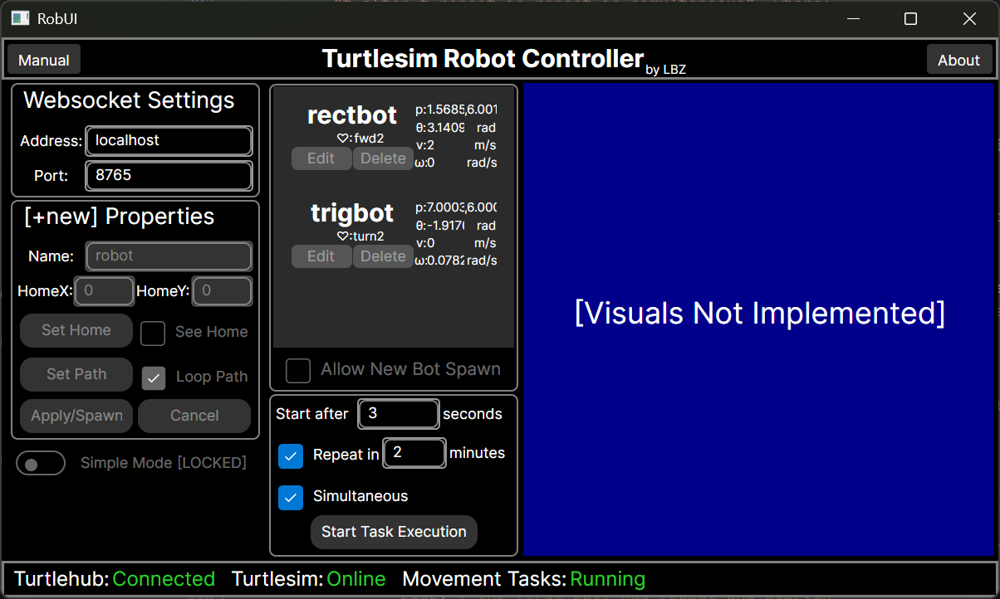
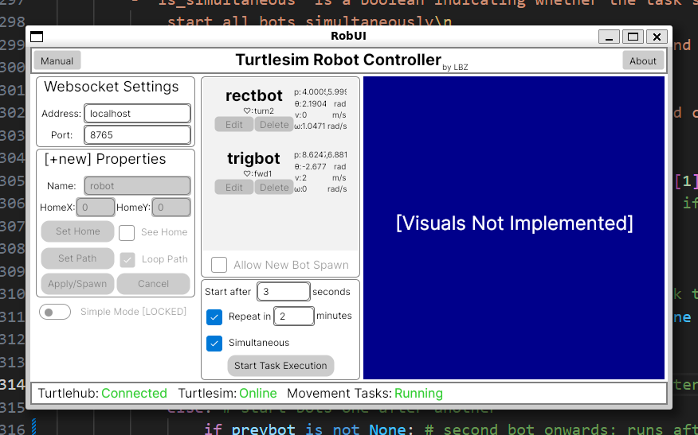

# Time-Controlled Dual Robot Simulator

## Sections
1. [Required Functionalities](#required-functionalities)
1. [Project Components](#project-components)
    1. [RobUI](#robui)
    1. [ROS2Socket](#ros2socket)
    1. [Turtlebot](#turtlebot)
    1. [Turtlehub](#turtlehub)
1. [Compatibility](#compatibility)
1. [Dependencies](#dependencies)
1. [Usage](#usage)
    1. [Basic Usage](#basic-usage)
    1. [Advanced Usage](#advanced-usage)
1. [UI Documentation](#ui-documentation)

## Required Functionalities
1. Textbox for user to input time in seconds after which the robots should start moving.
1. Checkbox to select simultaneous or sequential movement.
1. Checkbox to allow user to repeat the task every 2 minutes.
1. Button to start the task execution.
1. Robot ignores new movement commands until the current movement is complete.
1. Movements of the 2 robots are different, i.e. one draws a rectangle and the other draws a triangle.
1. Uses Turtlesim as the simulation environment.

## Project Components

### RobUI
1. written in CSharp
1. Generalizable to control different robots in TurtleSim.
1. Decoupled from the ROS2 environment.
1. Communicates to a ROS2 node via a WebSocket connection.
1. Provides a cross-platform, modern and user-friendly GUI interface.

### ROS2Socket
1. written in Python
1. Contains a WebSocket server to communicate with the RobUI.
1. Arguments configurable via a YAML file.
1. Receives messages from the RobUI and publishes them to its own output topic.
1. Subscribes to its own input topic and sends messages to the RobUI, if connected.
1. Periodically publishes the status of connection to its own status topic.

### Turtlebot
1. written in Python
1. Can be run by the command line with arguments, or by instantiating the class.
1. On creation, spawns its turtle in the Turtlesim environment.
1. Subscribes to its own input node and control the turtle:
    - Movement Commands (ignored if the robot is already moving):
        - `start` starts the turtle's movement task
        - `startin:t` starts the turtle's movement task after `t` seconds.
        - `repeat:t` sets the robot to repeat the task every `t` seconds.
        - `edit:pt1,pt2,...` sets the goals to the points in the list, stops at the last point.
        - `editloop:pt1,pt2,...` sets the goals to the points in the list and loops back to the first point.
        - `home:x,y,theta` homes the turtle to the point and orientation.
    - Control Commands (can be executed at any time):
        - `pause` pauses the turtle's movement.
        - `resume` resumes the turtle's movement.
        - `stop` stops the turtle's movement and homes it.
        - `kill` kills the turtle and quits the node.
1. Publishes to its own output node with the turtle's state.

### Turtlehub
1. written in Python
1. Takes responsibility to start `turtlesim_node` if it is not running.
1. Takes responsibility to start `ros2socket` if it is not running.
1. Subscribes to ROS2Socket's output node and interpret the messages to control the Turtlebots.
1. Subscribes to the Turtlebots' state nodes and ROS2Socket's state node. Composite them with its own state and send them to ROS2Socket's input node.
1. On termination, attempt to kill the `turtlesim_node`, `ros2socket`, and `Turtlebot` nodes.

## Compatibility
| ROS Version | Ubuntu Version | Python Version |  Compatible* |
|-------------|-----------------|-------------|--------------|
| ROS2 Jazzy Jalisco | 24.04 LTS | 3.12.3 | Yes |

*Note that other combinations of ROS and Ubuntu versions may work, but have not been tested.

| OS Version | .NET SDK Version | UI Compatible** |
|------------|-------------------|---------------|
| Ubuntu 24.04 LTS | .NET 8.0 | Yes |
| Windows 11 24H2 | .NET 8.0 | Yes |

** Note that other combinations of OS and .NET versions may work, but have not been tested.

## Dependencies
- `ros-jazzy-turtlesim`
    - Can be installed using the following command:
        ```bash
        sudo apt update && sudo apt install ros-jazzy-turtlesim
        ```
- `dotnet-sdk-8.0`
    - Can be installed using the following command:
        ```bash
        sudo apt update && sudo apt install dotnet-sdk-8.0
        ```
- `rosdep` Dependencies
    - Can be installed using the following command from the root of the workspace:
        ```bash
        rosdep update && rosdep install -i --from-path src --rosdistro jazzy -y
        ```

## Usage

### Basic Usage
1. Depending on your ROS installation, add these line to your `.bashrc` file.
    ```bash
    source /opt/ros/jazzy/setup.bash
    source /usr/share/colcon_cd/function/colcon_cd.sh
    export _colcon_cd_root=/opt/ros/jazzy/
    ```
1. Build the package from the root of the workspace
    ```bash
    colcon build
    ```
1. Source the workspace overlay setup file.
    ```bash
    source install/setup.bash
    ```
1. Run the `turtlehub` node
    ```bash
    ros2 run robmove turtlehub --ros-args --params-file config/turtlehub.yaml
    ```
1. In another terminal, build and run the UI project in the `src/robui/robui` directory after the `turtlehub` node has started.
    ```bash
    cd src/robui/robui
    dotnet run -c Release
    ```
1. The UI should open up. See the [UI Documentation](#ui-documentation) for more information on how to use it.
1. When closing the project, ***DO NOT*** use the [X] button on the `turtlesim` node, because it is managed by the `turtlehub` node automatically. Manually closing `turtlesim` may cause dangling processes. ***Instead***, do these steps:
    - press `Ctrl+C` in the terminal where the `turtlehub` node is running, 
    - ***wait for 1-2 seconds*** for the nodes in the subprocesses to terminate. You may see `publisher's context is invalid` in the terminal, it is normal because the node where the publisher is running has just terminated.
    - then ***press*** `Ctrl+C` ***again***. You will see `turtlehub gracefully stopped` in the terminal.
1. For the UI window, use the [X] button to close it.

### Advanced Usage
1. The default address and port used by the ROS2Socket node is `localhost:8765`. To change this, edit the `config/ros2socket.yaml` file. By using an appropriate address, you can run the UI on a different machine.
1. If you run the UI on Windows, you can connect to the ROS2Socket node running on Ubuntu in WSL2 by using `localhost` as the address.
1. If you wish to run each node manually, you should read the code documentation to understand the parameters required by each node. Running each node separately is not thouroully tested and may not work as expected.

## UI Documentation
### Interface Screenshots
| Dark Mode (on Windows 11 24H2) | Light Mode (on Ubuntu 24.04 LTS in WSL2) |
|-----------|------------|
|  |  |

###  Simple Manual For UI

1. Start the server by running it in the terminal ***BEFORE*** starting the UI.
1. Observe on the bottom of the window, the status bar shows the connection status of `Turtlehub`.
2. Wait until the text shows `Turtlehub: Connected  Turtlesim: Online`.
3. Two robots, `rectbot` and `trigbot`, will be spawned automatically. You see them on the list.
4. Right below the list, you can see the Task Configuration section. Change the values if you want.
5. Click the `Start Task Execution` button to start the task, and observe how the robots move.
6. While robots are moving, you can see their states updated in real-time on the list.
7. If the `Movement Tasks` label shows `Running`, subsequent movement instructions will be ignored. The ignore logic is on the server, not the UI.
8. You can overwrite the robots' movement instructions by changing the task configuration and clicking the button again, as long as the task is not running.

A more detailed manual can be accessed by clicking the `Manual` button. It provides a brief overview of the UI and how to use it.

### Communication Protocol
#### For developers. You can skip this section if you are a user of the UI.
The UI communicates via WebSocket to the ROS2Socket node. The messages are plain strings with the following format:
```
cmd:data
```
Where `cmd` is the command and `data` is the data associated with the command. The following commands are supported:
```
spwn:name,x,y,theta,loopback,goal1,goal2,...
kill:name
strt:t_after,t_repeat,is_repeat,is_simultaneous
```
Where each command `cmd` is defined as follows:
| Command | Description |
|---------|-------------|
| `spwn` | Spawns a new robot with the given parameters or changes the parameters of an existing robot. |
| `kill` | Kills the robot with the given name. |
| `strt` | Starts the task execution with the given parameters. |

For example, when the UI starts, 2 robots: `rectbot` and `trigbot` are spawned with the following commands:
```
spwn:rectbot,1.0,4.0,0.0,T,4.0,4.0,4.0,6.0,1.0,6.0
spwn:trigbot,6.0,3.0,0.0,T,9.0,7.0,7.0,6.0
```
If the user:
- has input `5` in the `Start After ... seconds` textbox and `2` in the `Repeat in ... minutes` textbox,
- has checked the `Simultaneous` checkbox and the `Repeat in` checkbox,
- clicks on the `Start Task Execution` button,

the following command will be sent to the ROS2Socket node (where `120` is the number of seconds in `2` minutes):
```
strt:5,120,T,T
```
The design philosophy is to keep the communication simple and easy to understand, and to completely decouple the UI from the ROS2 environment and the logic that controls the robots. The UI should do no more than presenting received data as a user-friendly interface and sending user input as plain strings.